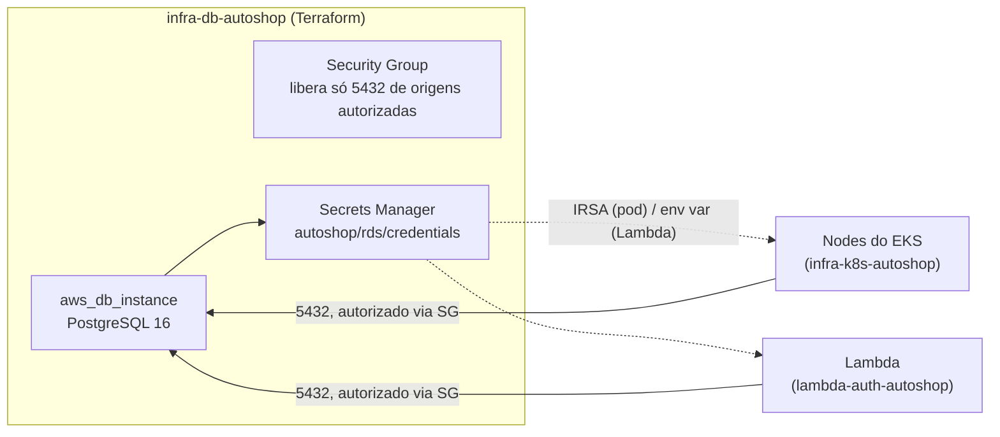

# infra-db-autoshop

Provisionamento do banco de dados gerenciado (RDS PostgreSQL) usado pela
aplicação [`app-autoshop`](https://github.com/Jackeline2020/app-autoshop) e
pela function serverless [`lambda-auth-autoshop`](https://github.com/Jackeline2020/lambda-auth-autoshop).
Terraform puro — nenhum código de aplicação.

Este é o repositório 3 dos 4 exigidos pela Fase 3 do Tech Challenge. Os
outros três: [`app-autoshop`](https://github.com/Jackeline2020/app-autoshop)
(aplicação), [`infra-k8s-autoshop`](https://github.com/Jackeline2020/infra-k8s-autoshop)
(cluster Kubernetes) e [`lambda-auth-autoshop`](https://github.com/Jackeline2020/lambda-auth-autoshop)
(autenticação por CPF).

## Por que PostgreSQL (RFC)

A Fase 2 usava DynamoDB. Pra Fase 3, com um banco gerenciado real na AWS,
a escolha foi PostgreSQL (RDS) em vez de manter DynamoDB: o domínio tem
relacionamentos (OS → cliente, veículo, peças, serviços) que se beneficiam
de chaves estrangeiras e transações ACID — em especial a dedução de
estoque na aprovação de orçamento, onde condições de corrida importam e o
MVCC do Postgres resolve isso de forma natural. `pgx` é um driver Go de
qualidade alta, e o RDS Postgres não tem custo de licença (diferente de
SQL Server). Justificativa completa em
[`docs/rfc/RFC-001-postgres-database.md`](https://github.com/Jackeline2020/app-autoshop/blob/main/docs/rfc/RFC-001-postgres-database.md)
(repositório `app-autoshop`) e diagrama ER em
[`docs/database/er-diagram.md`](https://github.com/Jackeline2020/app-autoshop/blob/main/docs/database/er-diagram.md).

## Arquitetura



Acesso ao banco é só por security group explícito — sem IP público. Hoje
autoriza os nodes do EKS (`eks_node_security_group_id`, colado a partir do
output do `infra-k8s-autoshop`) e, opcionalmente, outras origens (ex: a
Lambda de autenticação) via `additional_db_ingress_security_group_ids`.

## Tecnologias

- Terraform (provider `aws`)
- AWS RDS PostgreSQL 16, AWS Secrets Manager

## Pré-requisitos

- Terraform >= 1.5
- Uma VPC com subnets (usa a VPC default da conta — ver "Considerações")
- O `infra-k8s-autoshop` já aplicado pelo menos uma vez, pra ter o output
  `eks_node_security_group_id`

## Como aplicar

```bash
terraform init
terraform apply \
  -var="eks_node_security_group_id=<output do infra-k8s-autoshop>"
```

Depois do apply, copie os outputs pros repositórios que dependem deles:

| Output | Onde colar |
|---|---|
| `rds_endpoint` | Secret `DB_HOST` do `app-autoshop` (usado no ConfigMap do overlay `aws`) |
| `rds_secret_arn` | Secret `RDS_SECRET_ARN` do `infra-k8s-autoshop` (variável `rds_secret_arn` do Terraform em `infra/aws`) e Terraform do `lambda-auth-autoshop` |

## Pipeline CI/CD (`.github/workflows/ci-cd.yml`)

1. **terraform-validate** — valida o Terraform em toda PR.
2. **deploy** — aplica `terraform apply` contra a AWS real, controlado
   pela variável de repositório `AWS_DEPLOY_ENABLED`.

Secrets necessários: `AWS_ROLE_ARN`.
Variável: `AWS_DEPLOY_ENABLED`.

## Considerações de produção

- **Rede**: usa a VPC default da conta (mesma do `infra-k8s-autoshop`).
  Uma produção real usaria uma VPC dedicada, com sub-redes
  públicas/privadas segregadas.
- **State**: gerenciado localmente. Uma equipe com múltiplos
  colaboradores usaria state remoto (ex: S3 + lock no DynamoDB).
- **Backup**: `backup_retention_period = 1` e `skip_final_snapshot = true`.
  Numa base de produção, esses valores seriam maiores, junto com
  `deletion_protection = true`.
